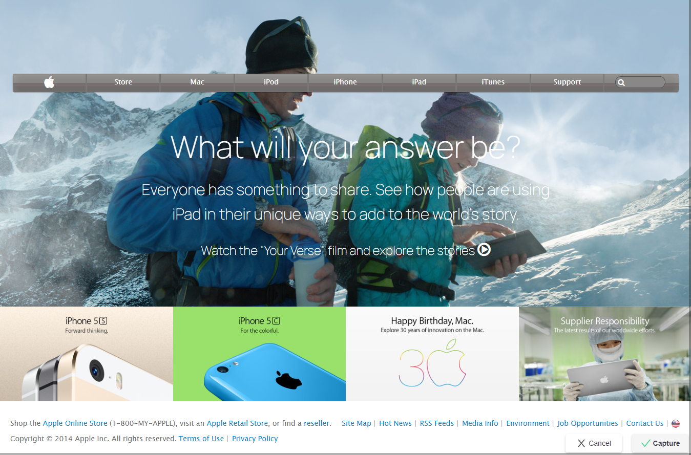

# apple-webpage-clone
A repository for the cloning of old apple webpage

> ​
> 
> ​

## Built With

- HTML
- CSS
- Fontawesome
  ​

## Live Demo

​
[Live Demo Link](https://rawcdn.githack.com/uimarshall/apple-webpage-clone/f20230240c5bc4465985e1dacb8f8cee1aa31f19/index.html)
​
​

## Getting Started

​
**Clone the repo on your system, find the index.html file and open with your browser**
​
​

## Authors

#### 👤 **Marshall AKPAN**

​

- Github: [@uimarshall](https://github.com/uimarshall)
- Twitter: [@uimarshall](https://twitter.com/uimarshall)
- Linkedin: [uimarshall](https://www.linkedin.com/in/marshall-akpan-19745526/)

​

## �� Contributing

​
Contributions, issues and feature requests are welcome!
​
Feel free to check the [issues page](https://github.com/haraphat01/newyorktimes/issues).
​

## Show your support

​
Give a ⭐️ if you like this project!
​

## Acknowledgments

- Fontawesome
- Our Stand up teams
- Microverse TSE
- Google fonts

  ​

## �� License

​
This project is [MIT](lic.url) licensed.

